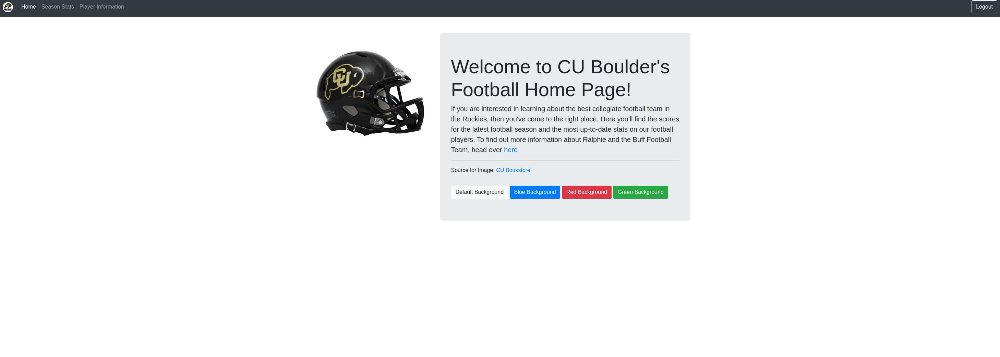
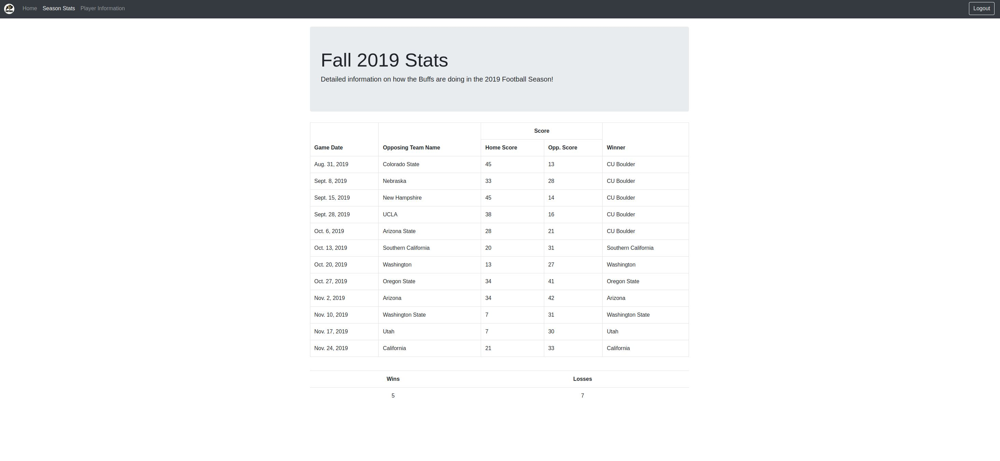
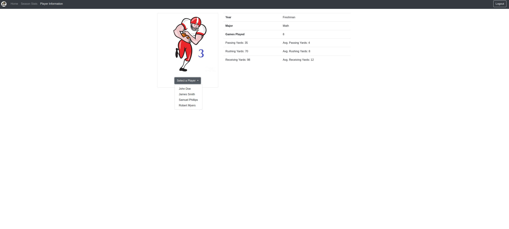

# Lab_Website_2

#Create a school football stats website with JavaScript

Javascript pushes data dynamically into the page.

## Home:
Can use radio buttons to change color of website

## Stats: 
List season stats for football team

## PLayer.JPG
Player stats for the season

## Lab Website 3.0
There is another repository for the same website that **dynamically creates webpages using pug and node.js. T0 get it to run
you must install postgres and node js.** This website is much easier to run and better for demostrations however, website 3.0 
is much better. 

**Here is the link: https://github.com/aali7075/-Lab_Website_3**
